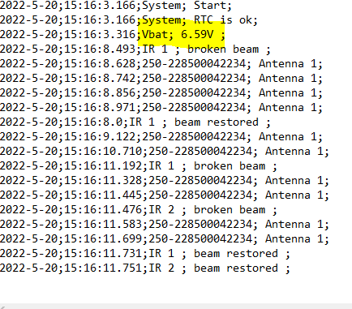

# Check List

- [X] RTC OK
  - [X] La RTC donne l'heure correcte
  - [X] à chaque démarrage
  - [X] d'un jour sur l'autre

- [X] RFID always ON
- [X] RFID logged in file

- [ ] Temperature acurracy
- [ ] Temperature logged in file

- [X] IR Events OK
- [X] IR Events Switch ON RFID
- [X] IR Events Recorded

- [ ] Fichier de configuration chargement OK
- [ ] Enregistrement OK

- [ ] Special TAG
- [ ] Modes de capture

- [X] **Mesure de la tension de batterie**
- [X] Écriture du voltage de la batterie intempestive et très variable
Mesures batteries rendues périodiques
```if (time_last_voltage.unixtime() + 2 <= now.unixtime())```
Et ajout de condensateur au borne de la pin de lecture (1uF) et au bornes de la batterie (1mF)

- [X] Mauvaise Lecture batterie
AVANT: Lecture batterie par le dispositif: 6.59V sur pin 9 (mesure batterie interne)
alors que la batterie (3 piles rechargeables 1.2V) est mesuré au multimètre à 3.57V
APRES: Problème résolu en mettant un pont diviseur sur une autre pin que la pin 9



- [X] **Mise hors tension du système pour protéger les piles.**

- [X] **éteindre LED ext au bout d'1 min**
