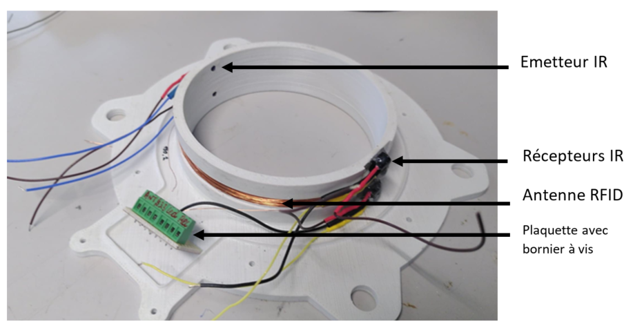
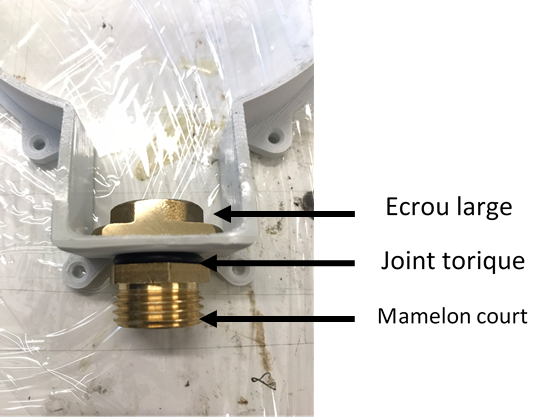
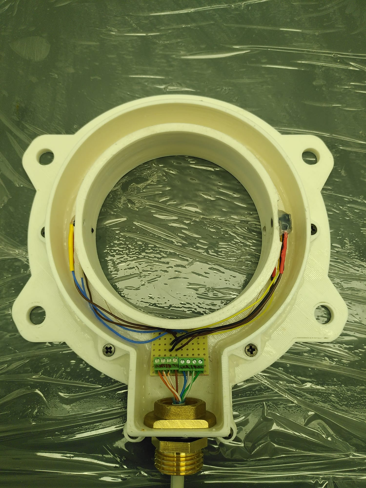

# Réalisation de l'antenne et de sa gaine métallique

L'antenne se compose de deux pièces

- Une pièce qui forme les bords intérieurs. On y insert les capteurs IR et on y câble directement l'antenne. Pièce **« Socle.stl »**

- Une pièce qui forme les bords extérieurs et vient se visser sur la première, avec un joint étanche pour assurer l'étanchéité entre les 2. Pièce **« Socle_couvercle.stl »**

## Nomenclature Mécanique

Extrait de la nomenclature mécanique :

|#| Description|Désignation|Fournisseur|Référence|
|------|-----------------|----------------------------------------------------------------|-------|----|
|1| Mamelons court  | mamelons réduits à visser laiton M 12 x 17 pour tube en cuivre | Leroy Merlin |65814385 |
|2| écrou large | contre-écrous à visser laiton M 12 x 17 pour tube en cuivre | Leroy Merlin |65816345|
|3| Mamelon Long | Adaptateur Laiton Droit Legris R Mâle 1/2pouce - Mâle 3/8pouce  | RS PRO |3108781|
|4| écrou laiton | Écrou de tube Norgren série 22 G 3/8 Laiton | RS PRO |226-763|
|5| joint torique |  joint torique support gaine | RS PRO |1964872 |
|6| Gaine Inox | Flexible Inox Ff15x21 Longueur 800 Mm - Dn8 | Leroy Merlin |84420925|

- **Impression 3D** du « Socle.stl » et du **« Socle_couvercle.stl »** en ABS

- **Première couche de résine époxy d'imprégnation** sur les parois qui
    recevront la coulée. Prendre une résine prise longue (par ex 24h)
    pour avoir le temps d'étaler la résine au pinceau sur les parois.
    (Exemple Araldite DBF et son durcisseur HY956)

## Socle

{: style="width:400px"}

- **Câblage Antenne** pour une impédance de 190uH (+ ou - 29 spires)

- **Câblage IR** (récepteurs et led émetrices)

- **Collage (étanche) des IR sur Socle**

  - LED IR à emmancher de force + colle chaude pour être sûre

  - Récepteur IR à maintenir en position par colle chaude

  - Couche de colle polyuréthane (Araldite 2028-1 au pistolet ) pour
        former un bulbe sur la partie intérieur (et éviter la terre de
        s'accumuler au passage des hamsters).

## Couvercle

{: style="width:400px"}

- **Usiner deux méplats** sur l'écrou large en laiton.

- **Visser** mamelons laitons + joint torique avec l'écrou large sur le couvercle.

## Assemblage

{: style="width:400px"}

- **Préparation de la plaquette** : Utiliser du fil gainé Téflon, diamètre TODO, longueur 30cm, en respectant les couleurs de fil de l'image.

Un câble type « ethernet », de 3 paires de fils torsadés, est utilisé
pour relié la partie Antenne de la malette étanche.

| Couleur                           | Fonction                          |
|-----------------------------------|-----------------------------------|
| Vert                              | Récepteur IR 1                    |
|Blanc/Vert                         | Récepteur IR 2                    |
|Bleu                               | Emetteur IR 1                     |
|Blanc/Bleu                         | Emetteur IR 2                     |
|Marron                             | 3.3V                              |
|Blanc/Marron                       | GND                               |
|Blanc/Orange                       | Antenne +                         |
|Orange                             | Antenne -                         |
|Blindage                           | Câblé au GND                      |

- **Préparation câble Ethernet**: Dénuder et étamer les deux
    extrémités des fils.

- **Visser les fils sur bornier à vis**

- **Vérifier fonctionnement de la partie antenne**

- **Installation joint** en mousse dans le mamelon qui assure étanchéité entre câble et mamelon.

- **Passer le câble** dans l'entrée du couvercle (donc dans le joint en mousse + mamelon + écrou)

- **Passage du câble Ethernet** dans gaine inox + mamelon long

## Coulée

- **Application du Silicone** (LOCTITE SI 595 Superflex transparent
    application à la seringue) sur toute la jonction socle/couvercle

  - Visser le couvercle sur le socle à l'aide de vis
        auto-taraudeuses (6mm)

  - Attendre le séchage complet avant nouvelle manipulation

- **Doubler l'étanchéité** à l'aide de pâte à fixe au niveau du
    mamelon et partout où cela semble nécessaire

- **Maintenir le câble** en hauteur et installer **la partie antenne
    bien à plat**

- **Couler la résine époxy** prise rapide et opaque dans l'antenne.
    ( Rencast FC 52 Polyol + isocyanate chez Samaro OU chez Résine et
    moulage : KIT RESINE EPOXY DE COULEE DIELECTRIQUE NOIRE 1060/68 )
