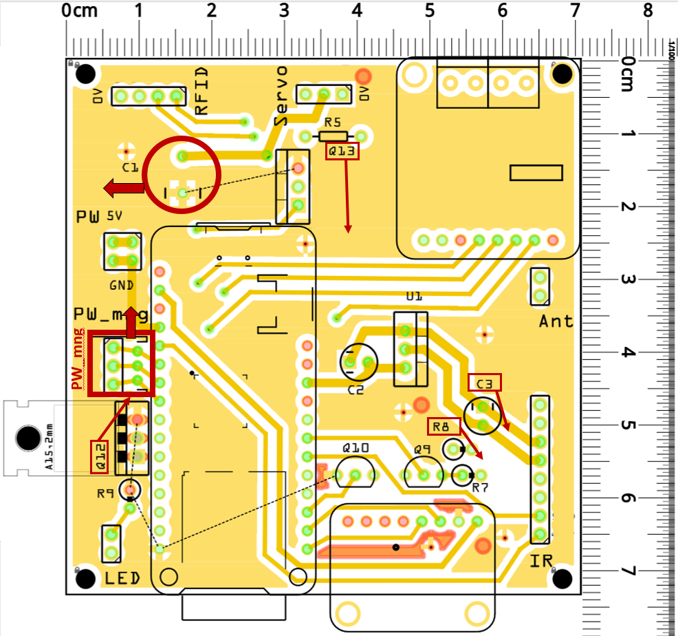

# Electronic

## All boards

* Transfer the project into Kicad software
* Replace all possible components by SMD
* Note pins name on the two faces of the boards

## Main board

* Note connector pin name into schematic (currently empty, only connector name is indicated)
* Once components mounted, some designation are not visible anymore : Q12 / Q13 / R8 / C3
* C3 capacitor is mounted bent with its reference on the lower side, not visible --> No possible to identify the component once mounted. Mounting direction has to be reversed.
* JST PW_mng connector is too close to Q12 capacitor --> Diffitult to handle it. Move the connector a few millimeters (new space can be used to indicate its designation)
* C1 capacitor interferes with the micro-USB cable. It should be shifted from 5 to 10mm top the left

{: style="width:400px"}

## Power board 5V

* C2 100 nF et C3 100 nF capacitors must be replaced by components 0805 105K X7R 50V SMD in 1206 size. C2 must not be a discrete component (disturbing once the board is placed).
* A circuit track must be cut : the one that connects the battery voltage to the power boost. Normally a shut-off switch should be used to shut off power between the battery and the rest of the system. Now this track makes a permanent connection. (Modification already made on fritzing 04/08/2022).
* The position of the 4 holes has to be changed : Two are too close to the solar panel charger (shord circuit with screws) - Another is too close from C4 capacitor (short circuit) - The last is too close from the screw terminal block
* Remove the double row of the PW connector : A single row is enough
* PW GND and 5V pins are not visible once the capacitor is folded. Add them on the edge of the board (or enlarge the board by 2.54mm)

{: style="width:400px"}

## Power board 12V

* Define slots to connect IR emitter and receiver cables : 4 x 3V3 et 4 x GND
* Remove footprints under the Adafruit boards

## Interface board

* Transfer the project into Kicad software
