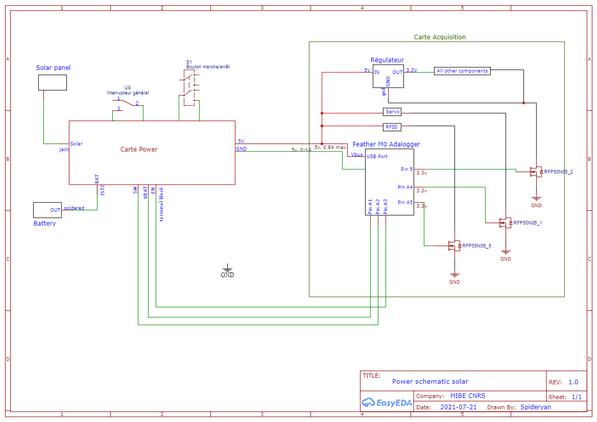

# Overview

L'alimentation de la carte Acquisition est en 5V.

La "carte Power" assure la conversion et la gestion de la batterie, pour envoyer en sortie du 5V.

- L'interrupteur général coupe l'alimentation en entrée du convertisseur VBAT / 5V.
- Le bouton marche arrêt ou Switch, permet par un appui prolongé, l'allumage ou l'éteignage du système par le software.
- La recharge par panneau solaire est optionnelle.

Les 3 câbles de données [EN;SW;Vbat] entre les 2 cartes servent à :

- EN: si cette entrée est mise à l'état haut, l'alimentation de l'acquisition est coupée.
- SW: passe à l'état haut si le bouton marche/arrêt est appuyé.
- Vbat: renvoie l'information de la tension de la batterie entre 0 et 3.3V à l'aide d'un pont diviseur

Il a été conçu 2 types de carte Power:

- [5V power supply board](./Power-5V.md) qui permet d'utiliser des batteries Li-Po ou Li-Ion avec l'option rechargement par panneau solaire ou par USB C.
- [12V power supply board](./Power-12V.md) qui permet d'utiliser des batteries allant de 9V à 18V.
