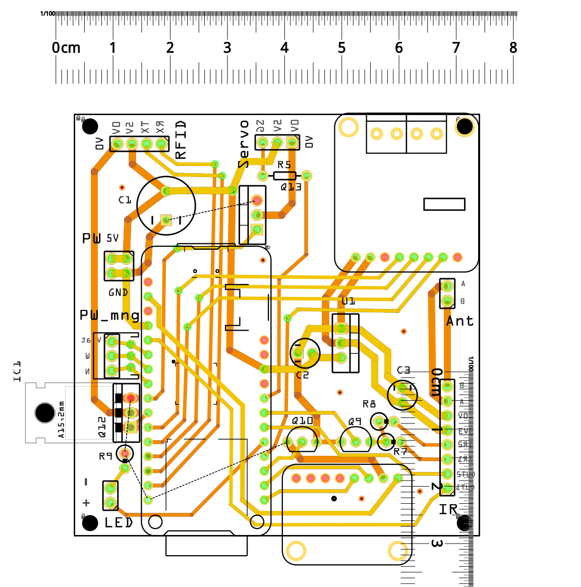

# Montage des cartes électroniques

Positionner les composants selon l'implantation donnée par la représentation du PCB et la nomenclature de chaque carte. Commencer par souder les composants les plus petit / les moins haut sur les cartes.

## Carte d'acquisition

[Consulter la nomenclature](https://gitlab.in2p3.fr/rfid_m0/rfid_m0.elec/-/blob/master/sch%C3%A9ma%20202206/Nomenclature.xlsx)

[Consulter le projet CAO](https://gitlab.in2p3.fr/rfid_m0/rfid_m0.elec/-/blob/master/sch%C3%A9ma%20202206/Fritzing%20Files/Nichoir_main.fzz)

## Carte d'alimentation 12V

[Consulter la nomenclature](https://gitlab.in2p3.fr/rfid_m0/rfid_m0.elec/-/blob/master/sch%C3%A9ma%20202206/Nomenclature.xlsx)

<!-- TODO
[Consulter le projet CAO]() -->

## Carte d'alimentation Lithium

[Consulter la nomenclature](https://gitlab.in2p3.fr/rfid_m0/rfid_m0.elec/-/blob/master/sch%C3%A9ma%20202206/Nomenclature.xlsx)

[Consulter le projet CAO](https://gitlab.in2p3.fr/rfid_m0/rfid_m0.elec/-/blob/master/sch%C3%A9ma%20202206/Fritzing%20Files/Nichoir_power.fzz)
