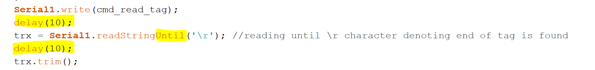

# Informatique

## Problème réactivité de la lecture RFID

La lecture RFID au début du projet était trop lente pour détecter le
passage des hamsters. Pour résoudre ce problème les modifications
suivantes ont été apportées :

-   L'alimentation déclenchée par une détection IR a été modifiée par
    une alimentation continue de la carte RFID. Cela permet d'éviter le
    temps de démarrage de la carte.

-   Un délai de 10ms après une demande de lecture et après la lecture de
    sa réponse.

-   La commande de lecture de la réponse RFID « Serial1.redString () » a
    été remplacée par « Serial1.readStringUntil('\\r') ». Cela permet de
    s'arrêté de lire dès que la carte à envoyer son caractère de fin.

> {width="6.3in" height="0.7527777777777778in"}

-   La résolution d'une petite erreur sur la détection IR permet une
    lecture RFID dès que l'IR change d'état (de 0 à 1 ou de 1 à 0).
    Avant la lecture RFID n'était demandée qu'une fois que la barrière
    IR était rétablie (fin du passage du hamster). C'était déjà trop
    tard pour demander une lecture.
