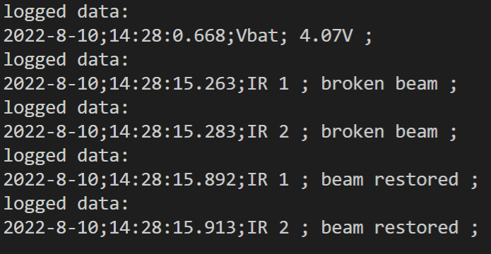

# Infrared functionnality

## Description

La barrière infrarouge utilise le principe et les composants destinés aux télécommandes infrarouges. En effet, on émet une lumière pulsée infrarouge à une certaine fréquence (36kHz). En face on place un photo détecteur qui passe à l'état bas seulement si il détecte un rayonnement IR à cette fréquence. Ainsi Ces capteurs infrarouge fonctionnent en tout ou rien. On ne peut pas régler la distance de détection. Plus le rayonnement Infrarouge est intense plus la barrière infrarouge peut être grande (plusieurs mètres).

## Software used to generate a 36 kHz Pulsed Width Modulation

For generating a PWM on the Feather M0, we use the SAMD21 turbo PWM library on an available [PWM pin](./assets/images/TODO/Pinout_Feather_M0.png)

<!-- markdownlint-disable MD010 -->
```C
#include "SAMD21turboPWM.h"         // https://github.com/ocrdu/Arduino_SAMD21_turbo_PWM

#define PIN_IR_PWM      11          // output pwm 36kHz for IR sensor
//...
pinMode(PIN_IR_PWM, OUTPUT);
//...
TurboPWM pwm;
//...
pwm.setClockDivider(16, false);		// Main clock divided by 16 => 3MHz
pwm.timer(2, 4, 20, true);			// Use timer 2 for pin PIN_IR_PWM, divide clock by 4, resolution 20, single-slope PWM
pwm.analogWrite(PIN_IR_PWM, 500);   // PWM frequency is now around 36KHz, dutycycle is 500 / 1000 * 100% = 50%
```
<!-- markdownlint-enable MD010 -->

## PWM 36kHz - output generated

<!-- markdownlint-disable MD033 -->
<a href="../assets/images/TODO/Scope_IR_Modulation_output_1.png">

</a>
<!-- markdownlint-enable MD033 -->

Measurement made on the pin output of the Feather M0 without any Infrared emitter connected.

The Infrared emitter has an wide opening angle. For testing purpose, use heat shrink or wrap black tape around it to create a kind of pipe and reduce the opening angle.

## Infrared receiver - input read

<!-- markdownlint-disable MD033 -->
<a href="../assets/images/TODO/Scope_IR_input_1.png">

</a>
<!-- markdownlint-enable MD033 -->

Measurement made on the pin output of the Phototransistor TSOP34536.

## Émetteur Infrarouge

{: style="width:200px"}

Cathode (-) patte la plus courte (pas de méplat visible)

## Phototransistor TSOP34536

{: style="width:300px"}

Alimentation de 2.5V à 5.5V

[datasheet.pdf](https://www.vishay.com/doc?82490)

## Phototransistor TSOP31536

[datasheet.pdf](https://www.vishay.com/doc?82493)

## Examples on the web

* Comptage par franchissement d'une barrière infrarouge avec Arduino
UNO
<http://makerspace56.org/comptage-par-franchissement-dune-barriere-infrarouge/>

* Youtube la grotte du geek, code écrit pour l'environnement
STM32CubeIDE
<https://www.youtube.com/watch?v=\_tcBtZZDsCE>

* Adafruit "Using an Infrared Library on Arduino"
<https://learn.adafruit.com/using-an-infrared-library/sending-ir-codes>

## How to check the infrared barriers are working ?

TODO

Lorsqu'on passe la main et la retire, deux messages s'affichent " Broken beam puis restored sur la LED IR 1 et LED IR 2), donc les 2 LEDs fonctionnent !


