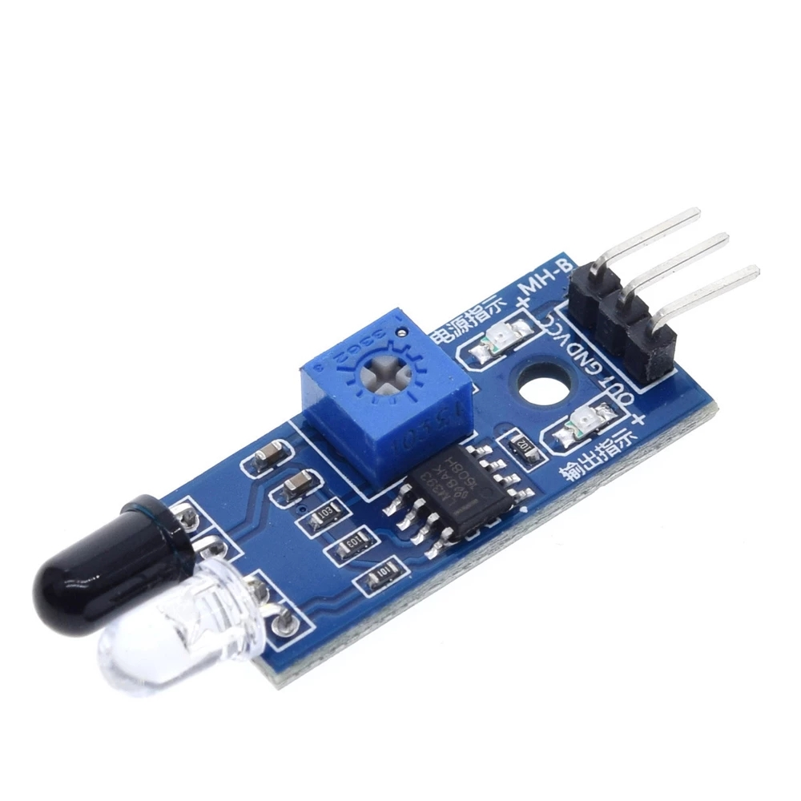
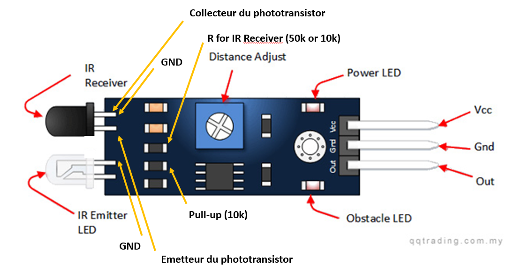
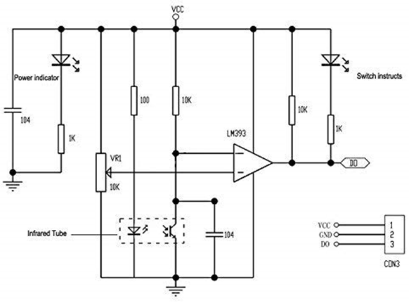
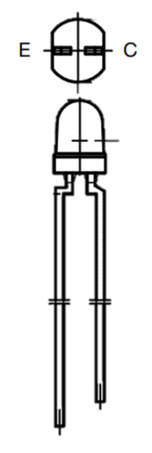

## Carte de développement

La Feather M0 Adalogger de Adafruit est une carte de développement de type Arduino spécialement conçue pour des applications d'enregistrement de données. Elle dispose de 256KB de mémoire flash, ce qui lui permet d'avoir un code plus volumineux que la plupart des modèles équivalents. Son slot microSD permet de ne pas manquer d'espace de stockage pour les données recueillies. **Cette carte fonctionne en niveau logique 3.3v, il faut donc faire attention à sa compatibilité avec les capteurs qui fonctionnent en 5v.**

[tutorial adafruit](https://learn.adafruit.com/adafruit-feather-m0-adalogger/pinouts)

## Servomoteur

Le servomoteur HS-53 de Hitec est adapté pour des systèmes miniaturisés ou économes en énergie. Sa vitesse de rotation est légèrement supérieure à un tour par seconde. L'alimentation optimale est de 5v, et il est commandé par PWM. Il peut délivrer un couple maximale d'environ 1,5 kg.cm

https://asset.conrad.com/media10/add/160267/c1/-/gl/001081926ML01/mode-demploi-1081926-mini-servomoteur-analogique-hitec-hs-53-112053-1-pcs.pdf

## Module RTC

Ce capteur conserve la date, l'heure, les minutes et les secondes grâce à sa pile intégrée. Il nécessite donc une très faible alimentation. En cas de désynchronisation, une fonction du code permet de redéfinir l'instant présent pour l'horloge. Ce capteur communique en I2C. Ici aussi une alimentation 5v est recommandée, mais le capteur fonctionne aussi en 3.3v.

[page produit adafruit](https://www.adafruit.com/product/3013)

[tutorial adafruit](https://learn.adafruit.com/adafruit-ds3231-precision-rtc-breakout/downloads)

## Module RFiD

Ce module permet à l'aide d'une antenne de détecter les tags RFiD à une portée de quelques centimètres. Il peut communiquer en TTL ou en RS-232. Cette carte est pratique comparé aux autres cartes disponible sur le marché car elle est relativement compacte et adaptée pour les projets de petite taille. Il faut aussi fournir l'antenne, mais cela peut être un avantage car on peut choisir comment l'intégrer au projet.

[pinout Connection drawing.pdf](uploads/81b7cef750505db74dd9b735ed8705fd/Connection_Drawing_TLB-30-SER.pdf)

[manuel de communication scotty.v1.4_TLB-30-Commands_.pdf](uploads/651a3e69d9c31fa0e2970c75e4627ca0/scotty.v1.4_TLB-30-Commands_.pdf)

## Capteur RTD

Le capteur RTD lit la température ambiante grâce à une résistance variable selon la chaleur. Sa plage de température est de 450 à -200 °C. Nous utiliseront une antenne à 2 fils, il faut alors souder certaines pistes sur le PCB pour adapter le capteur à ce mode de fonctionnement. On soudera les pastilles *2/3 wire* et *2 wire* et on s'assurera de connecter les fils de l'antenne aux bornes *F+* et *F-*.

[page produit adafruit](https://www.adafruit.com/product/3328)
[tutorial adafruit](TODO)

## Barrière infrarouge new version

Cette nouvelle barrière infrarouge, comparée à la précédente filtre les rayonnements infrarouges ambiants naturels, et s'affranchit de la luminosité de l'environnement.

### Description
La barrière infrarouge utilise le principe et les composants destinés aux télécommandes infrarouges. En effet on émet une lumière pulsée infrarouge à une certaine fréquence (36kHz). En face on place un photo détecteur qui passe à l'état bas seulement si il détecte un rayonnement IR à cette fréquence. Ainsi Ces capteurs infrarouge fonctionnent en tout ou rien. On ne peut pas régler la distance de détection. Plus le rayonnement Infrarouge est intense plus la barrière infrarouge peut être grande (plusieurs mètres).

### Émetteur Infrarouge
Cathode (-) patte la plus courte (pas de méplat visible)

Le code pour établir une PWM à 36kHz:

Librairie utilisé: https://github.com/ocrdu/Arduino_SAMD21_turbo_PWM

### Phototransistor TSOP34536
 Alimentation de 2.5V à 5.5V

datasheet:
[datasheetTSOP34536.pdf](uploads/8c364017c2e34e7aed8ab30ff57f4c3e/datasheetTSOP34536.pdf)

## Barrière infrarouge old version

### Description

Ces capteurs infrarouge fonctionnent en tout ou rien. On règle une distance de détection avec le potentiomètre, et la sortie prend une valeur haute ou basse si un objet est respectivement plus proche ou plus loin que la distance de détection. Leur alimentation se fait généralement en 5v, mais il fonctionne aussi en 3.3v.

### Modification à effectuer sur les cartes

- désactivation des indicateurs lumineux, suppression des résistances en série avec les LED. 
- Remplacement de la résistance de 10k en série avec le phototransistor par une d’environ 50k afin de diminuer la tension sur l'entrée + du comparateur
- Suppression de la résistance de 10k en sortie et activation de la résistance de pull-up interne coté microcontrôleur

### Émetteur Infrarouge
Même émetteur que la nouvelle version. 

### Phototransistor
Montage en Emetteur Commun donc Emetteur à la masse, Collecteur vers la sortie logique
