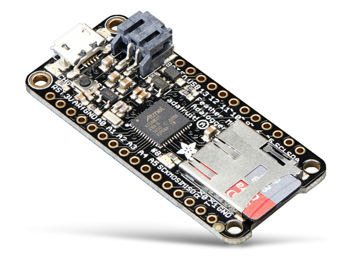
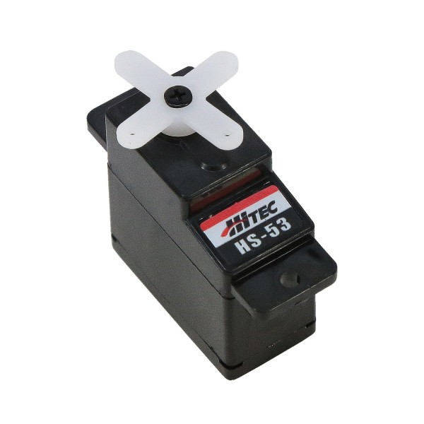
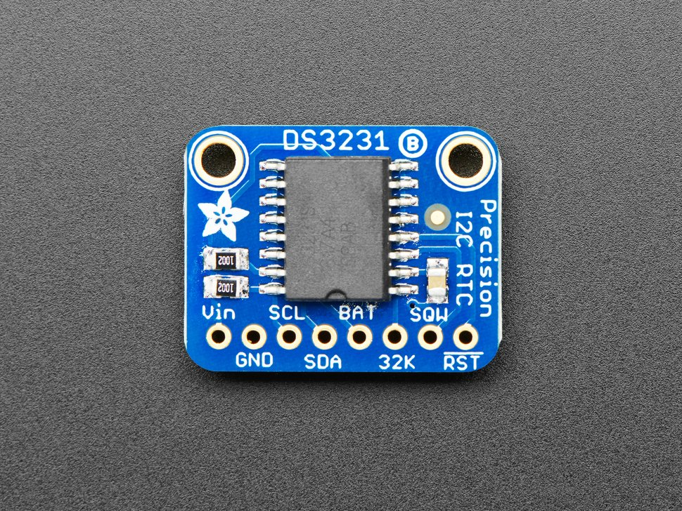
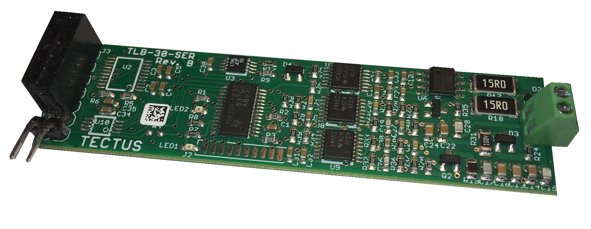
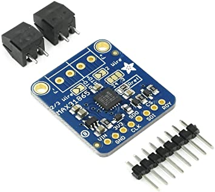
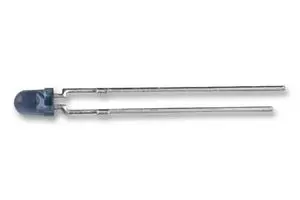
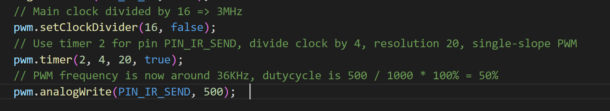
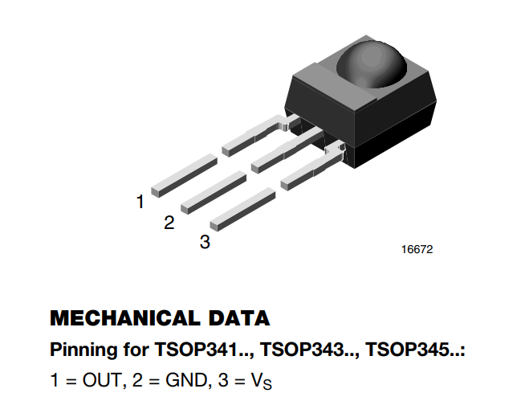

# Main board

## Schéma du circuit d'acquisition

Le système électronique est constitué de composants fonctionnant à différentes tensions:

* 5v (rouge) pour le servomoteur, le module RFiD, le feather M0 et un régulateur 3V3
* 3V3 provenant du feather (marron) qui alimente de manière permanente la RTC
* 3V3 provenant du régulateur (orange) qui alimente émetteurs et récepteurs IR, et le module MAX31865

On distingue les IO en bleu, l'alimentation de la carte en 5V en rouge, et la masse en noir. Plusieurs pins de communication de la carte Feather M0 sont utilisés, notamment les pins de communication I2C pour le RTC, SPI pour le RTD et UART pour le module RFiD.

Pour l'alimentation de cette carte d'acquisition se référer à la section [Overview](./Overview.md)

## Materials

### Carte de développement

{: style="width:250px"}

La Feather M0 Adalogger de Adafruit est une carte de développement de type Arduino spécialement conçue pour des applications d'enregistrement de données. Elle dispose de 256KB de mémoire flash, ce qui lui permet d'avoir un code plus volumineux que la plupart des modèles équivalents. Son slot microSD permet de ne pas manquer d'espace de stockage pour les données recueillies. **Cette carte fonctionne en niveau logique 3.3v, il faut donc faire attention à sa compatibilité avec les capteurs qui fonctionnent en 5v.**

[tutorial adafruit](https://learn.adafruit.com/adafruit-feather-m0-adalogger/pinouts)

### Servomoteur

{: style="width:200px"}

Le servomoteur HS-53 de Hitec est adapté pour des systèmes miniaturisés ou économes en énergie. Sa vitesse de rotation est légèrement supérieure à un tour par seconde. L'alimentation optimale est de 5v, et il est commandé par PWM. Il peut délivrer un couple maximale d'environ 1,5 kg.cm

[Datasheet](https://asset.conrad.com/media10/add/160267/c1/-/gl/001081926ML01/mode-demploi-1081926-mini-servomoteur-analogique-hitec-hs-53-112053-1-pcs.pdf)

### Module RTC

{: style="width:200px"}

Ce capteur conserve la date, l'heure, les minutes et les secondes grâce à sa pile intégrée. Il nécessite donc une très faible alimentation. En cas de désynchronisation, une fonction du code permet de redéfinir l'instant présent pour l'horloge. Ce capteur communique en I2C. Ici aussi une alimentation 5v est recommandée, mais le capteur fonctionne aussi en 3.3v.

[page produit adafruit](https://www.adafruit.com/product/3013)

[tutorial adafruit](https://learn.adafruit.com/adafruit-ds3231-precision-rtc-breakout/downloads)

### Module RFiD

{: style="width:300px"}

La carte RFID de tectus supporte les protocoles HDX, FDX et EM4102. Associée à une antenne de 190µH, sa portée dépend surtout de la taille de l'antenne et du transpondeur utilisé.

[pinout Connection drawing.pdf](./uploads/81b7cef750505db74dd9b735ed8705fd/Connection_Drawing_TLB-30-SER.pdf)

[manuel de communication scotty.v1.4_TLB-30-Commands_.pdf](./uploads/651a3e69d9c31fa0e2970c75e4627ca0/scotty.v1.4_TLB-30-Commands_.pdf)

### Capteur RTD

{: style="width:200px"}

Le capteur RTD lit la température ambiante grâce à une résistance variable selon la chaleur. Sa plage de température est de 450 à -200 °C. Pour utiliser une sonde à deux fils, on soudera les pastilles *2/3 wire* et *2 wire* et on s'assurera de connecter les fils de l'antenne aux bornes *F+* et *F-*.

[page produit adafruit](https://www.adafruit.com/product/3328)

[tutorial adafruit](TODO)

### Barrière infrarouge

Cette barrière infrarouge modulé à 36kHz filtre les rayonnements infrarouges ambiants naturels, et s'affranchit de la luminosité de l'environnement.

#### Description

La barrière infrarouge utilise le principe et les composants destinés aux télécommandes infrarouges. En effet, on émet une lumière pulsée infrarouge à une certaine fréquence (36kHz). En face on place un photo détecteur qui passe à l'état bas seulement si il détecte un rayonnement IR à cette fréquence. Ainsi Ces capteurs infrarouge fonctionnent en tout ou rien. On ne peut pas régler la distance de détection. Plus le rayonnement Infrarouge est intense plus la barrière infrarouge peut être grande (plusieurs mètres).

#### Émetteur Infrarouge

{: style="width:200px"}

Cathode (-) patte la plus courte (pas de méplat visible)

#### Le code pour établir une PWM à 36kHz

Librairie utilisé [Arduino SAMD21 turbo PWM](https://github.com/ocrdu/Arduino_SAMD21_turbo_PWM)

#### Phototransistor TSOP34536

{: style="width:300px"}

Alimentation de 2.5V à 5.5V

[datasheet.pdf](https://www.vishay.com/doc?82493)
