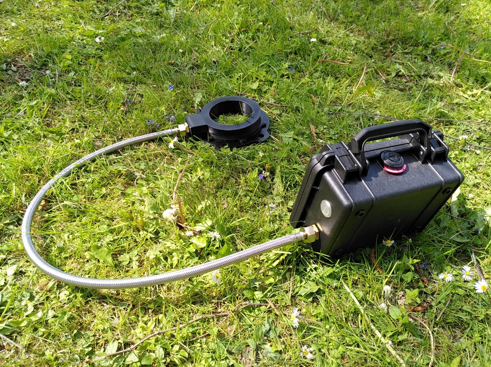

# Eléments mécaniques

{: style="width:400px"}

|#| Description|Désignation|Fournisseur|Référence|
|------|-----------------|----------------------------------------------------------------|-------|----|
|7| malette Pelicase | Malette de transport Peli 1120 | RS PRO |2963098|

PHOTO Mamelons + bouton sur malette

## Assemblage Mecanique

#### Malette

- **Perçages** et fixation des différents composants en sortie de la malette. Se référer au plan de perçage.

- **Etanchéifier** avec un joint torique pour le mamelon en laiton, avec les joints toriques prévus pour les boutons.

- **Collage écrou de la gaine** inox sur les 2 mamelons, côté antenne et malette, pour éviter que la gaine se dévisse. (Araldite 2028-1 au
    pistolet) /!\\ Ne pas trop serré pour permettre à l'antenne detourner sur elle-même

- **Fixation des supports** de cartes dans malette

- **Découpe mousse** de la malette, au format de la batterie, avec cutter.
