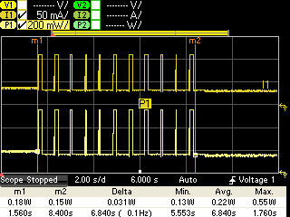
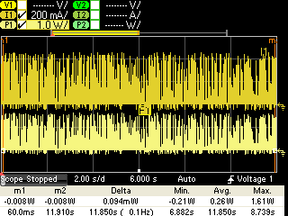
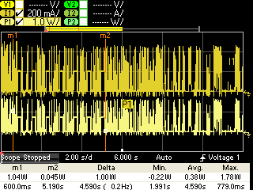
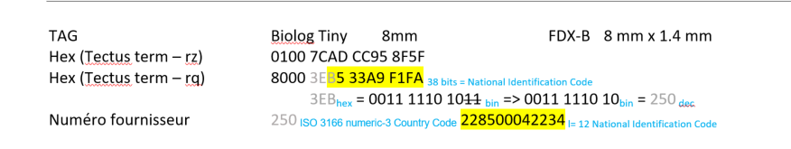

<!-- markdownlint-disable MD033 -->
# Electronique

## Circuit général

## Pinout feather M0 Adalogger

## Schéma du circuit d'acquisition

Le système électronique est constitué de composants fonctionnant à différentes tensions:

* 5v (rouge) pour le servomoteur, le module RFiD, le feather M0 et un régulateur 3V3
* 3V3 provenant du feather (marron) qui alimente de manière permanente la RTC
* 3V3 provenant du régulateur (orange) qui alimente émetteurs et récepteurs IR, et le module MAX31865

On distingue les IO en bleu, l'alimentation de la carte en 5V en rouge, et la masse en noir. Plusieurs pins de communication de la carte Feather M0 sont utilisés, notamment les pins de communication I2C pour le RTC, SPI pour le RTD et UART pour le module RFiD.

Pour l'alimentation de cette carte d'acquisition se référer à la section [Power Supply](https://gitlab.in2p3.fr/Julien/feather_m0/-/wikis/Power-supply)

## Consommation

### Mesures

Test consommation effectué avec une alimentation programmable (KEYSIGHT
N6705C).

Alimentation 5V du Feather M0 + RTC + RFID en acquisition

<object id="current" data="../media/current.htm" width="600" height="250"></object>

Puis test avec l'alim à la place de la batterie en 3.6V branchée sur le
PowerBoost

Tout compris RFID au repos

Tout compris RFID en acquisition

|                          |                 |                          |
|--------------------------|-----------------|--------------------------|
| Carte Feather M0 + RTC   |                 | <14mA>                     |
| Carte RFID Tectus + antenne   | Allumée au repos| <15mA>                     |
|                          | En acquisition  | 100mA sur 150ms          |
| Système Total            | RFID éteinte    | <0.18W>                    |
|                          | RFID au repos   | <0.26W>                    |
|                          | Acquisition (10 lectures RFID) | <0.38W>           |

Système Total:

* Carte Feather M0 + RTC
* Carte RFID Tectus + antenne
* 2 barrières IR
* Power Boost

### Calcul Autonomie

<object id="consumption" data="../media/consumption.htm" width="600" height="250"></object>

### Carte moyenne Puissance

Dakota 2010-0 TLB-30-BB LF

\\Projets\\RFID Tectus

