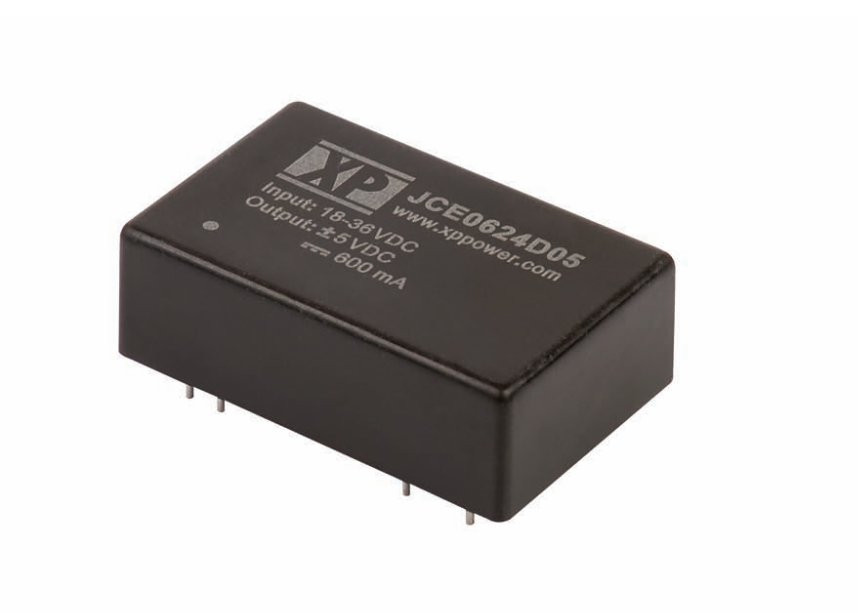
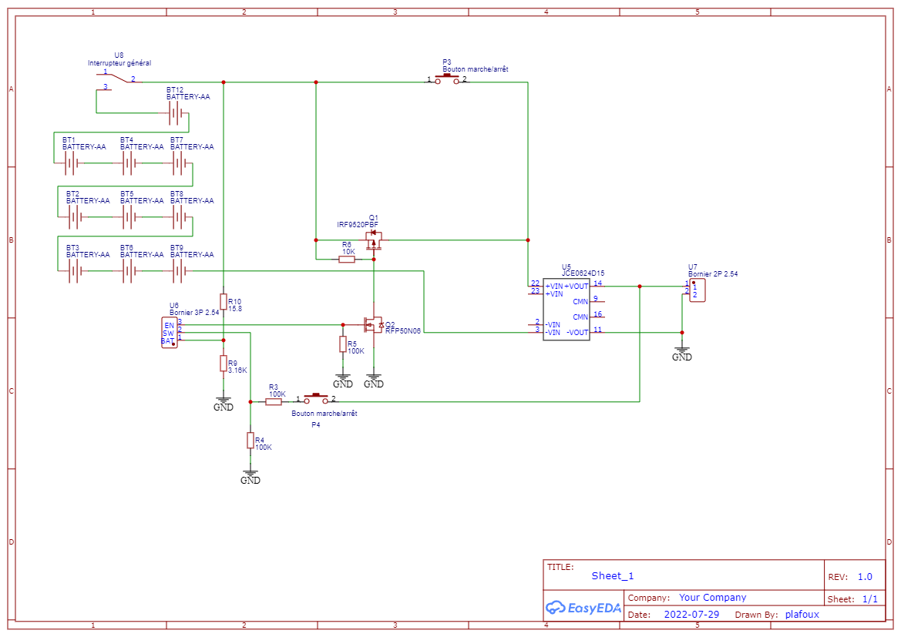

# Carte Pour batteries Plomb

Une autre manière d'alimenter le système est de partir d'une batterie 12V pour sortir du 5V en passant par un step Down de ce type: Convertisseur DC-DC XP Power, série JCE, 6W, sortie 5Vcc.

Avantages: choix de batterie plus large. Par rapport au Li-Po et Li-Ion, Possibilité de choix de batterie plus sécurisée: en manipulation, risque inflammabilité, plages de températures autorisées..

