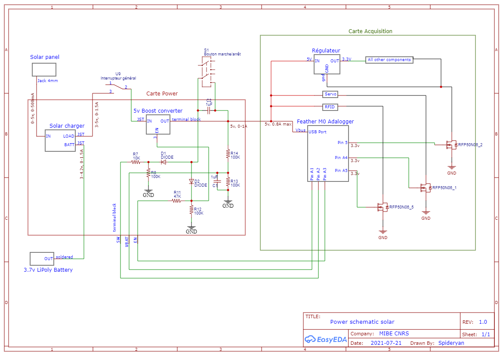
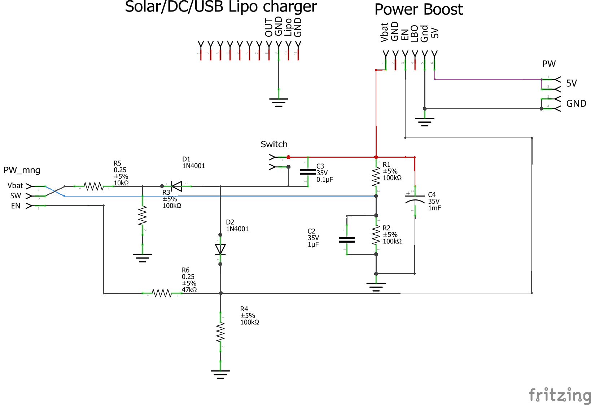
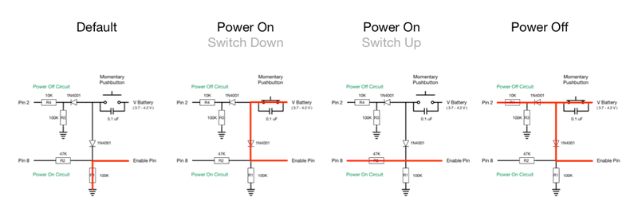
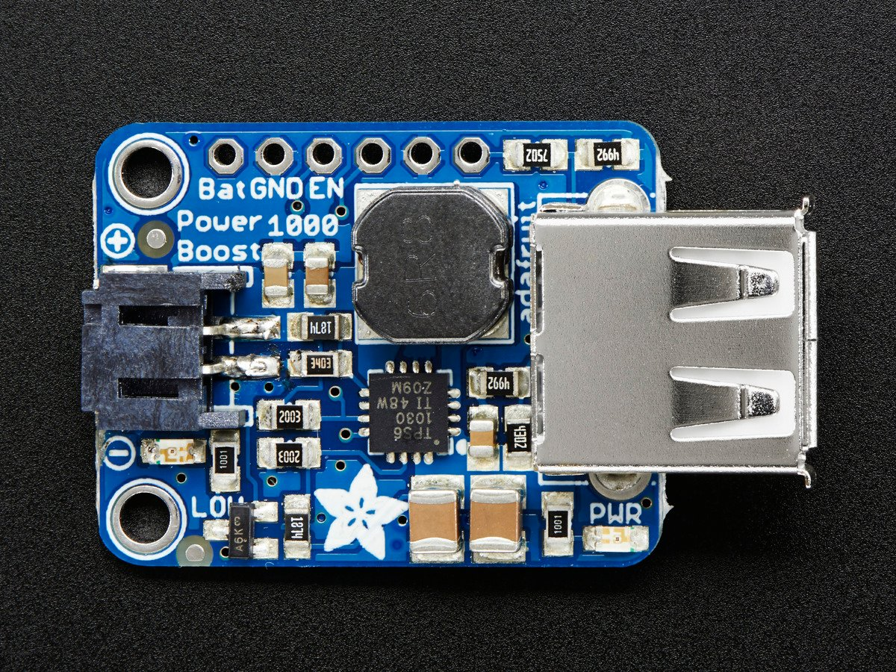
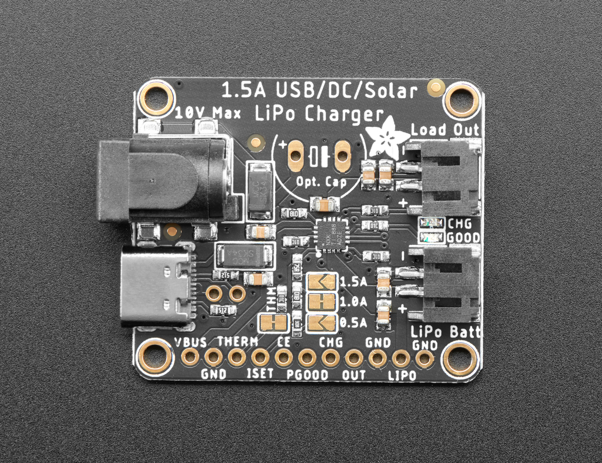
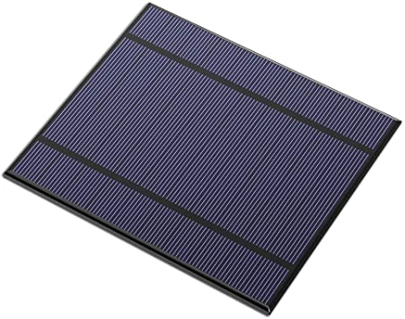

# Schéma général

# Gestion électronique et informatique

## schéma carte électronique power
Réalisation du routage de la carte sur fritzing.

## Lecture batterie
La tension d'une batterie LiPo ou de 3 piles AA en série peut aller jusqu'à 4.2V. Les pins de l'adalogger n'accepte pas plus de 3.3V. 
On réalise donc un pont diviseur composé de deux résistances de 100k (R1 et R2), et pour stabiliser la tension de la batterie on ajoute les condensateurs C2 et C4.

Au niveau informatique, une lecture batterie est effectuée à chaque boucle. La tension de la batterie est enregistrée sur la carte SD si celle-ci a baissé d'au moins 0.1V par rapport au dernier enregistrement. 

## Mise hors tension du système

La mise hors tension du système peut se faire de 2 manières:
- En coupant totalement l'accès à l'alimentation. Option intéressante à garder par sécurité.
- En avertissant le microprocesseur que l'on souhaite éteindre le système. Cela permet une mise hors-tension contrôlée et évite par exemple de corrompre la carte SD.

Pour cette dernière méthode nous nous sommes inspiré de ce [tuto_mise_hors_tension](https://github.com/craic/arduino_power/blob/master/PowerOnPowerOff.md)

Grâce à cette électronique, le software peut commander l'éteignage du dispositif (par exemple lorsque la lecture de la batterie est inférieure à un certain seuil). 

# Matériel

## Power Boost 1000

Le boost 5v sert à convertir la tension variable en sortie du chargeur solaire pour la fixer à 5v. Ce boost fonctionne à partir d'une entrée de 1.8v et peut délivrer jusqu'à 1A de courant.

| Vin (Min) (V)| Vin (Max) (V)|
| ------ | ------ |
| 1.8| 5.5|

[tutorial adafruit](https://learn.adafruit.com/adafruit-powerboost-1000-basic)

[datasheet du composant](https://www.ti.com/product/TPS61090)

## Chargeur solaire

Cette carte permet de charger la batterie LiPo 3.7v. Elle s'arrête lorsque la batterie est pleine et s'adapte particulièrement à l'alimentation très instable qu'apporte un panneau solaire. Lorsque le panneau est ensoleillé, il se peut qu'au lieu de charger la batterie le courant soit directement utilisé pour alimenter le système en aval. La tension en sortie de la carte peut donc fluctuer entre 3.7v et 5v car ici nous utilisons un panneau 5v. Le connecteur Jack prend beaucoup de place, il sera donc dé-soudé et on utilisera l'entrée microUSB.

[page produit adafruit](TODO)

[tutorial adafruit](https://learn.adafruit.com/adafruit-bq24074-universal-usb-dc-solar-charger-breakout/overview)

## Panneau solaire 

Ce panneau solaire a une puissance de 2.5W, il peut délivrer un courant jusqu'à 5V et de 500mAh. Il a des dimensions de 130cm x 150cm.

## Batterie

La batterie utilisé est une batterie Li Polymer de 3.7v et de 1.5Ah. Ces batteries ont la particularité de présenter une tension de 4.2v en charge maximale, puis elles descendent rapidement à 3.7v. Elles sont déchargées quand la tension tombe à 3v.