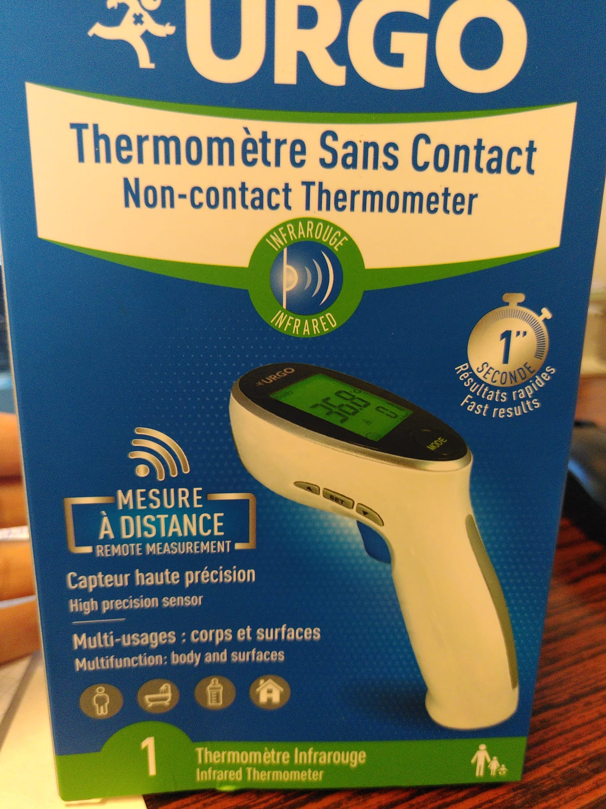
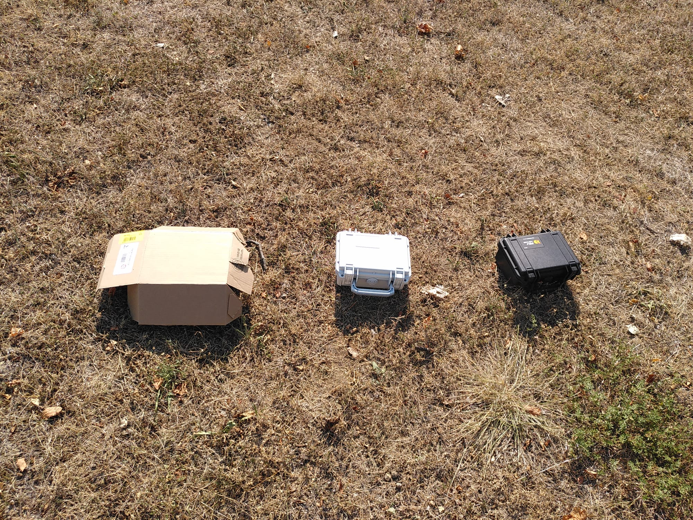

# TODO liste

## Electronique

### Power board 5V

#### Test à réaliser

* Mesures consommation des composants
* Test avec panneau solaire ( et amélioration de programmation associée)
* Protection contre la surchauffe: Avec l'aide d'un capteur de température, un arrêt logiciel de décharge de la batterie en cas de surchauffe a été programmé.  ( A VERIFIER, TESTER). Amélioration: envisager peut être une protection électronique interne et ne pas dépendre du bon fonctionnement du logiciel ?

### Power board 12V

* Remplacer les connecteurs P3 /P4 par des bornier à vis de pas 2.54mm
* Indiquer le + et le – pour le connecteur PWR_5V
* Corriger la piste en contact avec le plan de masse (pin EN --> Q2)
* Déplacer la dénomination Q1 pour la rendre visible une fois le composant installé et replié

### Main board

* Remonter les descriptions sur la face supérieure du circuit (connecteur IR, led, servo et RFID, PW_mng) pour meilleure visibilité
* Ajouter dénomination +/- sur le connecteur PW_5V
* Déplacer les dénominations Q12, Q13, C1, C3 et R8 pour les rendre visible une fois les composants installés
* Eloigner le connecteur PW_mng de Q12 pour faciliter la manipulation du connecteur
* Ne pas déplacer C1 mais indiquer dans le montage de le souder avec assez de longueur de pattes pour permettre de le plier (meilleure intégration mécanique)
* Inverser le sens de montage pour permettre de voir sa référence une fois le composant monté et plié

### Interface board

* Corriger le schéma : Diodes inversées

### Système complet

* Test réel d'autonomie
  * Premier test réalisé avec une batterie 10Ah Li-Ion qui a permis au système d'antenne terrier de tourner pendant 5.6jours

## Informatique

Liste des choses à faire **indispensables** ou de l'ordre de l'amélioration.

* **Gestion du temps**
* **Gestion de la milliseconde**
J'ai ajouté une gestion de la ms. Elle n'est pas encore parfaite car par exemple les cas 40.914s , 40.230s, 40.734s, 41.238s peuvent se produire mais la différence de temps entre les événements est correcte. elle ne sert qu'à l'enregistrement pour l'instant, elle n'est pas implémentée dans le comptage des délais.

* **Le fichier de configuration** n'est pas bien lu et écrasé par la configuration en dur du code. Problème toujours présent lors de tests le 26 juillet 2022.

* **Ajout filtrage software lecture batterie** Suite à un premier test d'autonomie, le système s'est arrêté (seuil fixé en dessous de 3V), alors que la tension batterie mesuré au multimètre est de 3.16V. EDIT: FONCTIONNALITE AJOUTEE. A TESTER SUR LONG TEST D AUTONOMIE

* **Mode_day_only pas utilisable pour une activation de nuit** qui serait très pratique pour le suivi des hamsters. Modifier la condition

`if (hours_current < config.start_time or hours_current > config.stop_time)`

par une heure de démarrage et une durée (unixtime).

* **Lecture de la température** ne fonctionne plus/pas avec nouveau programme/nouvelle carte?

* mode Interruption plutôt qu'une lecture IR, pour connaitre sens passage

* Vérifier la taille de carte SD maximum supportée

## Mécanique

* **Version robuste à l'extérieure**
A vérifier l'étanchéité du flexible de conduit au niveau des raccords.

* **Bouton poussoir à changer** les BP momentanée (SW) et stable (PW) doivent être remplacés pour être compatibles avec des capuchons de protection étanches à la poussière ET à l'eau.

* **Maintien cartes élec dans valise**

## Test température au soleil

Test réalisé le 04 août 2022 sur « l'herbe » devant le bâtiment 24.

Thermomètre utilisé : thermomètre infrarouge sans-contact pouvant
mesurer de 0° à 100°C.

--------------------------------------------------------------------------
Valise      Valise      Valise      Sol au      Sol à
carton      blanche     noire       soleil      l'ombre
------------- ----------- ----------- ----------- ----------- -----------
  Avant          30          30          30
  installation
  13h25

  13h45          40          48          58          31          40

  14h45          **52°**     **52°**     **66°**     60          **33**

  15h45          51          51          65          57          35

16h45          48          50          66          60          35
--------------------------------------------------------------------------

La Pelicase sous le carton est noire.

