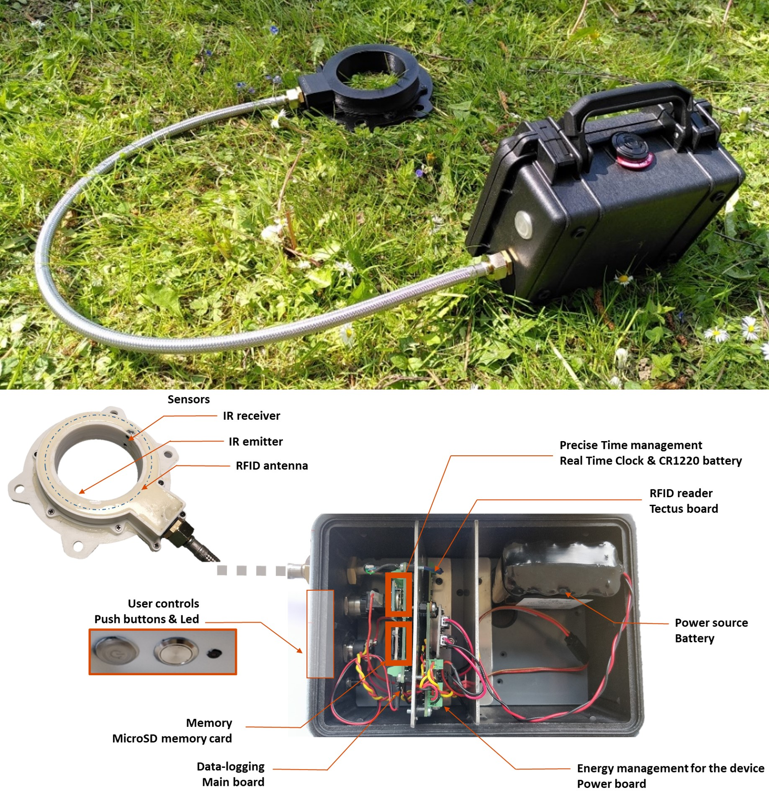
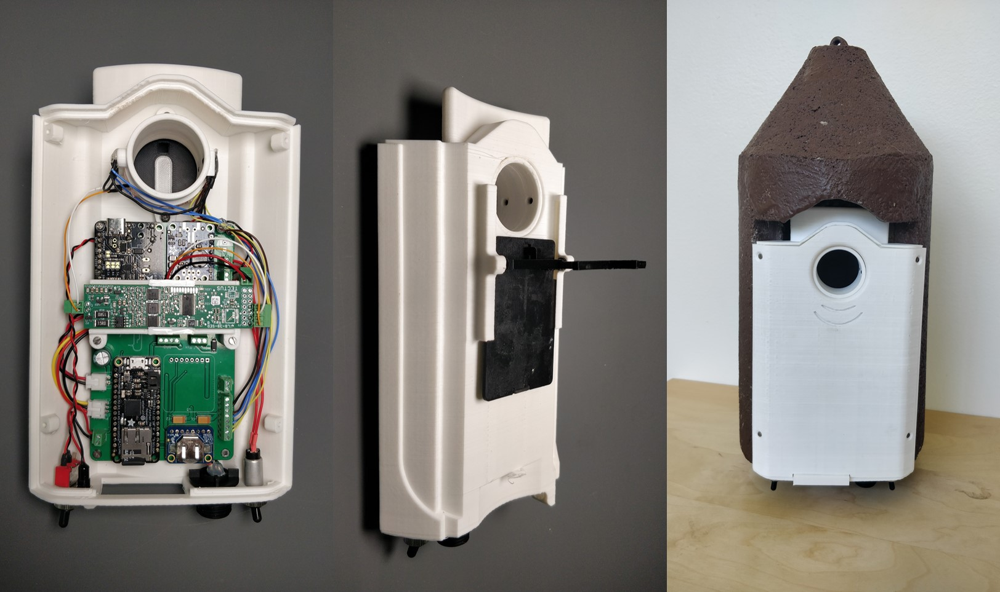

# Home

The rfid.m0 open source project provides the hardware, mechanical and code sources needed for building an embedded system that monitors relatively small species around their shelter.

The devices are gathering an RFID reader to identify TAG individuals, infrared beams to monitor an entrance, and eventually a temperature sensor.
Datas are recorded into an SD card with a timestamp from a real time clock.
Several powering options are proposed from running on standard battery to adding a solar panel.

For instance, two different applications can be applied with the project:

* monitor the burrow occupation of rodent species
* monitor the entrance of a nest box of bird species

Software and electronic sources are shared, mechanical is specific to the application.

## Rodent species device

The rodent species system is contained in a weatherproof case. Easy to transport and install, it can be deployed at the entrance of different burrows.

<!-- markdownlint-disable MD033 -->

<!-- markdownlint-enable MD033 -->

## Birds species device

The system for birds species is a device that is mounted in a Schwegler nest box, replacing the existing door. Additionally to the monitoring, an optional door can be automatically closed to capture individuals.

<!-- markdownlint-disable MD033 -->

<!-- markdownlint-enable MD033 -->
