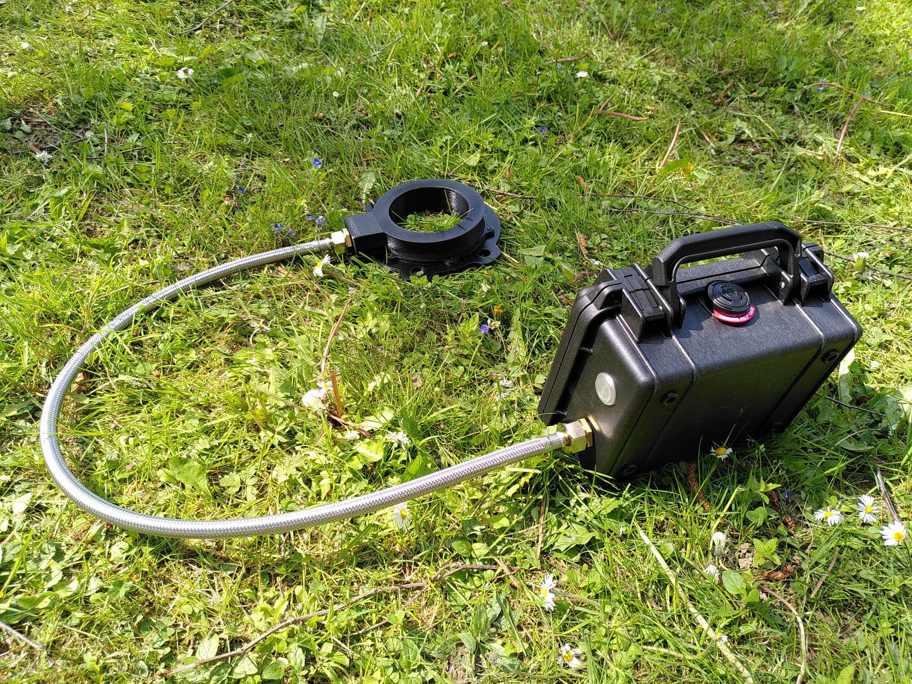
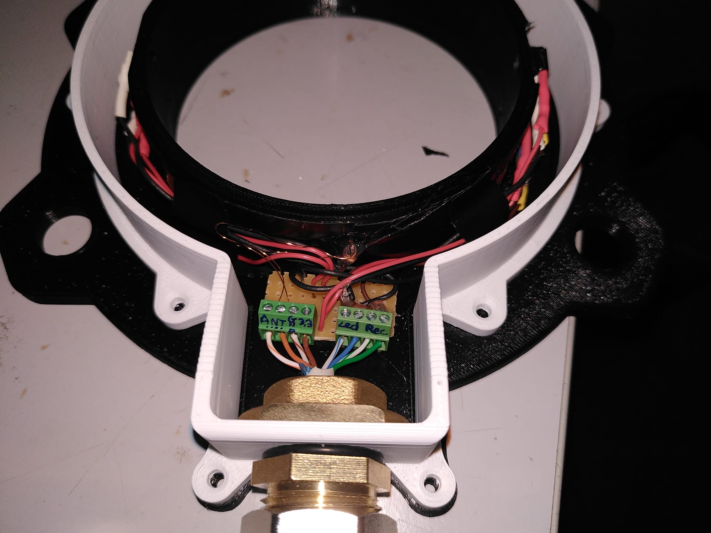
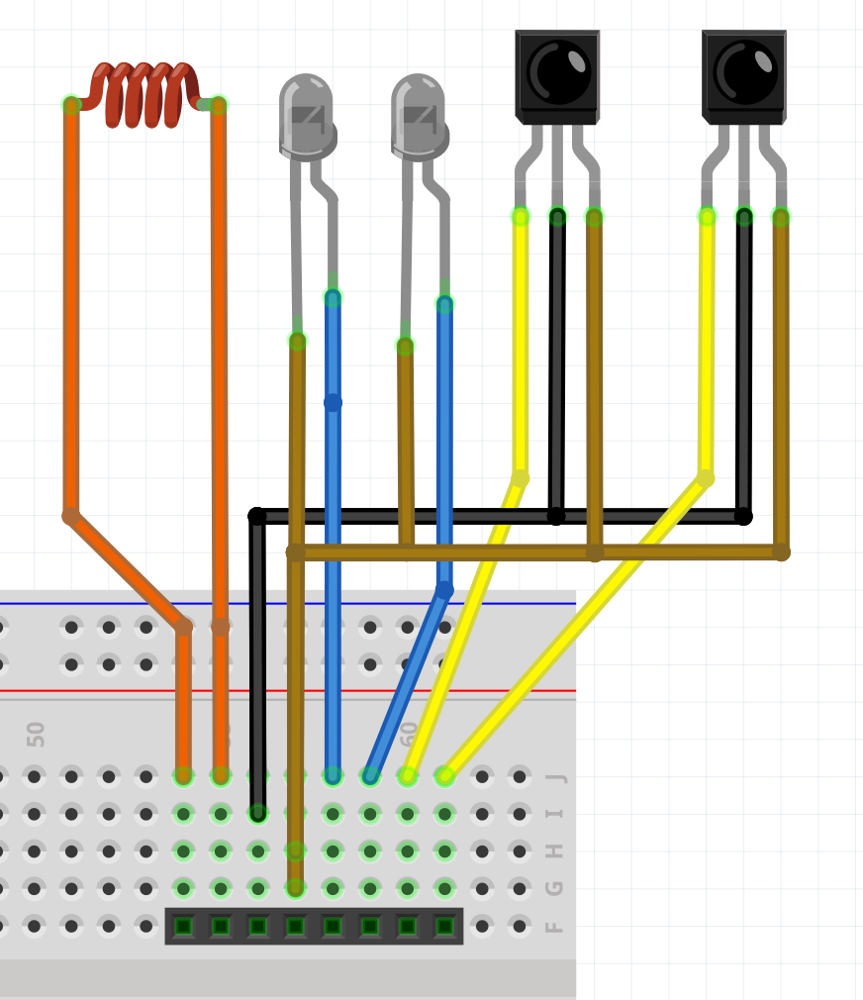
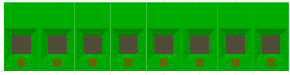
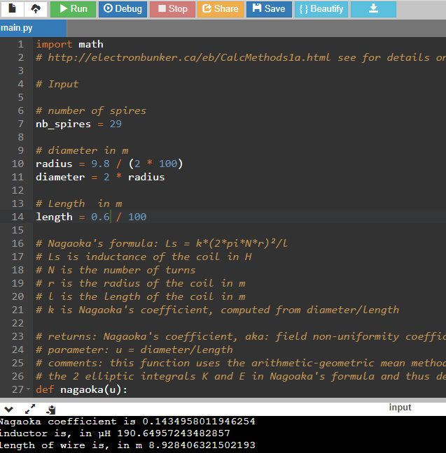

Projet Interreg Cricetus

Réu de commencement du 17janvier note :

<https://etherpad.in2p3.fr/p/17janv>

# Mécanique

## Vue d'ensemble

{width="6.891771653543307in"
height="3.8652777777777776in"}

### Nomenclature

Extrait de la nomenclature mécanique :

  ------------------------------------------------------------------------------------
  1   Mamelons court  mamelons réduits à visser  Leroy Merlin [65814385]{.underline}
                      laiton M 12 x 17 pour tube              
                      en cuivre                               
  --- --------------- -------------------------- ------------ ------------------------
  2   écrou large     contre-écrous à visser     Leroy Merlin 65816345
                      laiton M 12 x 17 pour tube              
                      en cuivre                               

  3   Gaine Inox      Flexible Inox Ff15x21      Leroy Merlin [84420925]{.underline}
                      Longueur 800 Mm - Dn8                   

  4   Capuchon        Couvercle de protection    RS PRO       **134-6527**
      poussière       pour Bouton-poussoir série              
                      MSM 19\                                 
                      série AV Transparent                    

  5   Mamelon Long    Adaptateur Laiton Droit    RS PRO       3108781
                      Legris R Mâle 1/2pouce -                
                      Mâle 3/8pouce                           

  6   écrou laiton    Écrou de tube Norgren      RS PRO       226-763
                      série 22 G 3/8 Laiton                   

  7   malette         Malette de transport Peli  RS PRO       **2963098**
      Pelicase        1120 en\                                
                      Polypropylène, Dimensions               
                      externes 90 x\                          
                      206 x 167mm, étanche                    

  8   joint torique   joint torique support       RS PRO       **1964872**
                      gaine (dima ??)                         
  ------------------------------------------------------------------------------------

## Partie Antenne

La partie Antenne est en 2 pièces :

-   Une pièce qui forme les bords intérieurs. On y insert les capteurs
    IR et on y câble directement l'antenne. Pièce **« Socle.stl »**

-   Une pièce qui forme les bords extérieurs et vient se visser sur la
    première, avec un joint étanche pour assurer l'étanchéité entre
    les 2. Pièce **« Socle_couvercle.stl »**

{width="5.276119860017498in"
height="3.3286537620297465in"}

{width="2.183905293088364in"
height="2.9092869641294836in"}{width="2.208954505686789in"
height="2.9421052055993in"}

###  

## Partie Malette

PHOTO Mamelons + bouton sur malette

## Assemblage Mecanique

#### Partie Antenne :

-   **Impression 3D** du « Socle.stl » et du ~~« Couvercle_creux.stl »~~
    **« Socle_couvercle.stl »**en ABS

-   **1^ère^ couche de résine époxy d'imprégnation** sur les parois qui
    recevront la coulée. Prendre une résine prise longue (par ex 24h)
    pour avoir le temps d'étaler la résine au pinceau sur les parois.
    (Exemple Araldite DBF et son durcisseur HY956)

Socle :

-   **Câblage Antenne** pour une impédance de 190uH (+ ou - 29 spires)

-   **Câblage IR** (récepteurs et led émetrices)

-   **Collage (étanche) des IR sur Socle**

    -   LED IR à emmancher de force + colle chaude pour être sûre

    -   Récepteur IR à maintenir en position par colle chaude

    -   Couche de colle polyuréthane (Araldite 2028-1 au pistolet ) pour
        former un bulbe sur la partie intérieur (et éviter la terre de
        s'accumuler au passage des hamsters).

-   **Soudure câbles IR sur plaquette** de jonction. Couper les fils IR
    au plus court pour éviter qu'ils dépassent de la coulée. Attention à
    dénuder le moins possible les fils du côté de la plaquette pour
    éviter des court-circuits entre les câbles.

Couvercle :

-   **Préparation câble Ethernet** : dénuder et étamer les deux
    extrémités des fils.

-   **Usiner deux méplats** sur l'écrou large en laiton

-   **Visser les fils sur bornier à vis**

-   **Vérifier fonctionnement de la partie antenne**

-   **Visser** mamelons laitons + joint torique avec l'écrou large sur
    le couvercle.

-   **Installation joint** en mousse dans le mamelon qui assure
    étanchéité entre câble et mamelon.

-   **Passer le câble** dans l'entrée du couvercle (donc dans le joint
    en mousse + mamelon + écrou)

Coulée

-   **Application du Silicone** (LOCTITE SI 595 Superflex transparent
    application à la seringue) sur toute la jonction socle/couvercle

    -   Visser le couvercle sur le socle à l'aide de vis
        auto-taraudeuses (6mm)

    -   Attendre le séchage complet avant nouvelle manipulation

-   **Doubler l'étanchéité** à l'aide de pâte à fixe au niveau du
    mamelon et partout où cela semble nécessaire

-   **Maintenir le câble** en hauteur et installer **la partie antenne
    bien à plat**

-   **Couler la résine époxy** prise rapide et opaque dans l'antenne.
    ( Rencast FC 52 Polyol + isocyanate chez Samaro OU chez Résine et
    moulage : KIT RESINE EPOXY DE COULEE DIELECTRIQUE NOIRE 1060/68 )

#### Partie Malette

-   **Peindre en blanc la malette** : 1 couche d'apprêt plastique sur
    toutes les faces avant de faire au moins 3 couches de peinture
    blanche.

-   **Perçages** et fixation des différents composants en sortie de la
    malette.

-   **Etanchéifier** avec un joint torique pour le mamelon en laiton,
    avec du silicone la fixation des boutons avec capuchons poussières.
    En effet les joints toriques prévus pour les boutons ne peuvent être
    utilisés avec en plus les capuchons de poussière.

-   **Passage du câble Ethernet** dans gaine inox + mamelon long

-   **Collage écrou de la gaine** inox sur les 2 mamelons, côté antenne
    et malette, pour éviter que la gaine se dévisse. (Araldite 2028-1 au
    pistolet) /!\\ Ne pas trop serré pour permettre à l'antenne de
    tourner sur elle-même

-   **Fixation des supports** de cartes dans malette

-   **Découpe mousse** de la malette, au format de la batterie, avec
    cutter.

## Test température au soleil

Test réalisé le 04 août 2022 sur « l'herbe » devant le bâtiment 24.

Thermomètre utilisé : thermomètre infrarouge sans-contact pouvant
mesurer de 0° à 100°C.

  --------------------------------------------------------------------------
                 Valise      Valise      Valise      Sol au      Sol à
                 carton      blanche     noire       soleil      l'ombre
  -------------- ----------- ----------- ----------- ----------- -----------
  Avant          30          30          30                      
  installation                                                   
  13h25                                                          

  13h45          40          48          58          31          40

  14h45          **52°**     **52°**     **66°**     60          **33**

  15h45          51          51          65          57          35

  16h45          48          50          66          60          35
  --------------------------------------------------------------------------

La Peli-case sous le carton st noire.

# Electronique

## Circuit général 

Voir wiki sur Gitlab

## Consommation

### Mesures

Test consommation effectué avec une alimentation programmable (KEYSIGHT
N6705C).

Alimentation 5V du Feather M0 + RTC + RFID en acquisition

{width="3.3333333333333335in"
height="2.5in"}

Puis test avec l'alim à la place de la batterie en 3.6V branchée sur le
PowerBoost

Tout compris RFID au repos

{width="4.395833333333333in"
height="3.2968755468066493in"}

Tout compris RFID en acquisition

{width="3.3333333333333335in"
height="2.5in"}

+-----------------------------------+-----------------------------------+
| Carte Feather M0 + RTC            | 14mA                              |
+===================================+===================================+
| Carte Tectus + antenne            | Allumée au repos : 15mA           |
|                                   |                                   |
|                                   | En acquisition : 100mA sur 150ms  |
+-----------------------------------+-----------------------------------+
| Système Total\* :                 | 0.18W RFID éteinte                |
|                                   |                                   |
|                                   | 0.26W RFID au repos               |
|                                   |                                   |
|                                   | 0.38W de moyenne en acquisition   |
|                                   | sur 6.8 secondes (10 lectures     |
|                                   | RFID)                             |
+-----------------------------------+-----------------------------------+
| \* : 2 paires                     |                                   |
| emetteurs/recepteurs IR + Feather |                                   |
| Mo + RTC+ Carte RFID + Powerboost |                                   |
| 5V                                |                                   |
+-----------------------------------+-----------------------------------+

### Calcul Autonomie

## Câblage 

### Antenne Terrier:

Un câble type « ethernet », de 3 paires de fils torsadés, est utilisé
pour relié la partie Antenne de la malette étanche.

{width="4.256163604549431in"
height="2.96875in"}

  -----------------------------------------------------------------------
  Vert                                Récepteur IR 1
  ----------------------------------- -----------------------------------
  Blanc/Vert                          Récepteur IR 2

  Bleu                                Emetteur IR 1

  Blanc/Bleu                          Emetteur IR 2

  Marron                              3.3V

  Blanc/Marron                        GND

  Orange                              Antenne +

  Blanc/Orange                        Antenne -

  Blindage                            Câblé au GND
  -----------------------------------------------------------------------

{width="3.6149464129483815in"
height="4.186491688538933in"}{width="1.299271653543307in"
height="0.29826662292213474in"}

## RFID

### Calcul Antenne

A partir du script python d'arthur
(\\\\[sbgpcs96.in2p3.fr](http://sbgpcs96.in2p3.fr/)\\mibe\\Projets\\RFID
Antennes\\Script)

Contrainte : Pour une inductance de 190uH et un diamètre d'environ 98mm 

{width="6.3in" height="6.409027777777778in"}

Résultat : 29 spires

### Carte moyenne Puissance

Dakota 2010-0 TLB-30-BB LF

\\Projets\\RFID Tectus

{width="6.298611111111111in"
height="1.1881944444444446in"}

## IR module

### Exemples/Tuto

-   Comptage par franchissement d'une barrière infrarouge avec Arduino
    UNO
    <http://makerspace56.org/comptage-par-franchissement-dune-barriere-infrarouge/>

-   Youtube la grotte du geek, code écrit par l\'environnement
    STM32CubeIDE https://www.youtube.com/watch?v=\_tcBtZZDsCE

-   Adafruit "Using an Infrared Library on Arduino"
    <https://learn.adafruit.com/using-an-infrared-library/sending-ir-codes>

### Librairie pour moduler signal IR:

A fast PWM library for SAMD21G-based Arduinos
<https://github.com/ocrdu/Arduino_SAMD21_turbo_PWM>

# Informatique

## Problème réactivité de la lecture RFID

La lecture RFID au début du projet était trop lente pour détecter le
passage des hamsters. Pour résoudre ce problème les modifications
suivantes ont été apportées :

-   L'alimentation déclenchée par une détection IR a été modifiée par
    une alimentation continue de la carte RFID. Cela permet d'éviter le
    temps de démarrage de la carte.

-   Un délai de 10ms après une demande de lecture et après la lecture de
    sa réponse.

-   La commande de lecture de la réponse RFID « Serial1.redString () » a
    été remplacée par « Serial1.readStringUntil('\\r') ». Cela permet de
    s'arrêté de lire dès que la carte à envoyer son caractère de fin.

> {width="6.3in" height="0.7527777777777778in"}

-   La résolution d'une petite erreur sur la détection IR permet une
    lecture RFID dès que l'IR change d'état (de 0 à 1 ou de 1 à 0).
    Avant la lecture RFID n'était demandée qu'une fois que la barrière
    IR était rétablie (fin du passage du hamster). C'était déjà trop
    tard pour demander une lecture.

# Question pour Pauline :

1.  Dans la CAO mécanique, qu'est ce que **Socle creux.stl** ? quelle
    est la différence avec **Socle_Couvercle.stl** ? puisque quand on
    ouvre les deux pièces, elles ont l'air identique.
